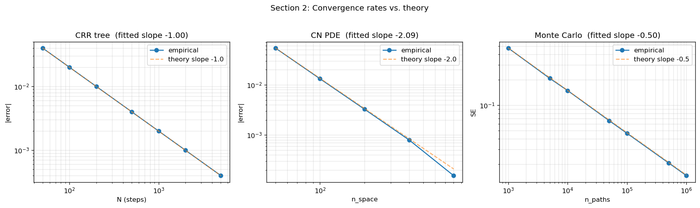
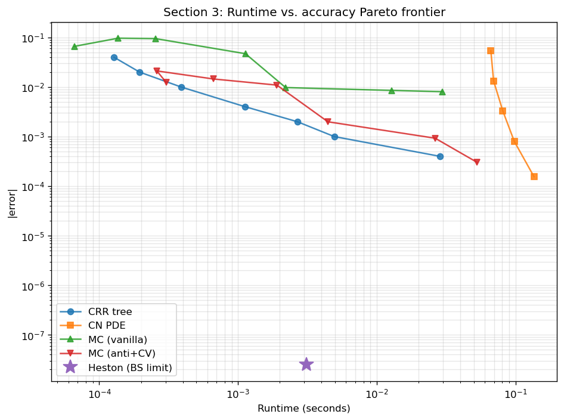
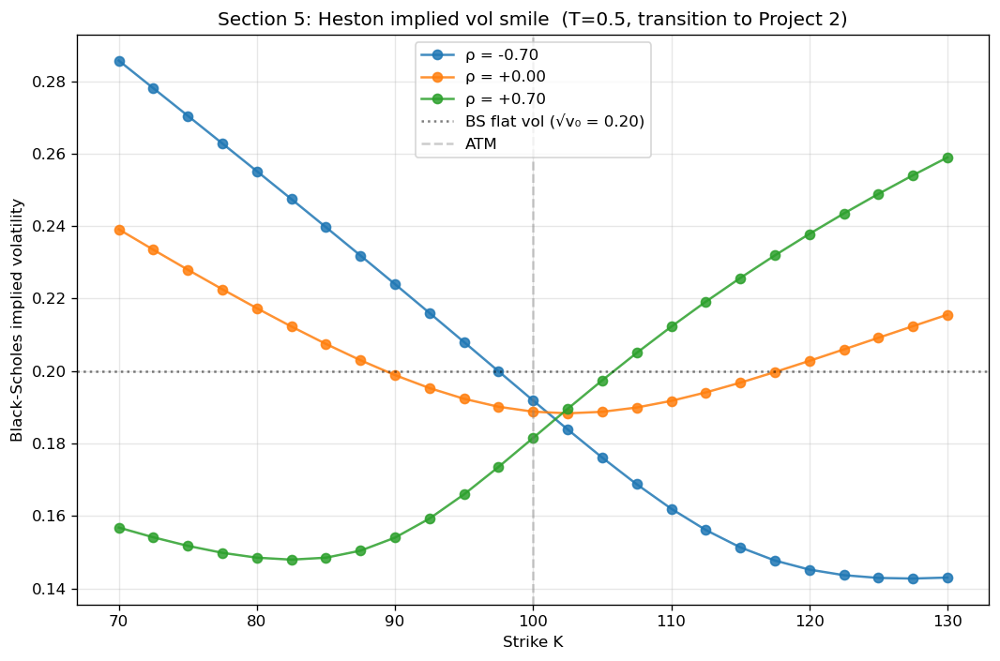

# Options Pricing Engine

A multi-model derivatives pricing library implementing Black-Scholes closed-form, CRR binomial trees, Crank-Nicolson PDE, Monte Carlo, and Heston stochastic volatility (Gil-Pelaez inversion). Built to compare analytical, numerical, and simulation-based approaches on equal footing, with rigorous convergence analysis and cross-method validation.

## Key Results

Five engines pricing a European call at S=K=100, T=1, r=5%, σ=20%:

| Method | Price | \|Error\| vs BS |
|--------|-------|-----------------|
| Black-Scholes closed-form | 10.450584 | — |
| CRR tree (N=500) | 10.446585 | 4.00e-03 |
| Crank-Nicolson PDE (400×5000) | 10.451381 | 7.97e-04 |
| Monte Carlo (100k, anti+CV) | 10.452235 | 1.65e-03 (z = +0.27) |
| Heston (BS limit) | 10.450584 | 2.50e-08 |

### Convergence rates match theory



Empirical slopes across three numerical methods, fit via log-log regression against the closed-form solution: CRR tree −1.00 (theory O(1/N)), Crank-Nicolson −2.09 (theory O(Δx²)), Monte Carlo standard error −0.50 (theory O(1/√n)). The slight excess in the PDE slope is temporal error becoming non-negligible at the finest spatial grid — itself a healthy sanity check on the discretization tradeoff.

### Runtime vs. accuracy Pareto



For 1D vanilla payoffs, the CRR tree dominates the low-to-mid accuracy regime and Crank-Nicolson takes over at high precision. Monte Carlo — even with antithetic sampling and control variates — is dominated across every accuracy target measured. This is the right answer: MC's comparative advantage is in high-dimensional or path-dependent problems where trees and PDEs don't scale.

### Heston implied volatility smile (transition to Project 2)



Under Black-Scholes, implied vol is constant. Under Heston, stochastic vol produces fatter tails than lognormal and the market prices that in — the shape of the smile is controlled by the correlation ρ. ρ = −0.7 gives the classical equity skew (OTM puts expensive, leverage effect); ρ = 0 is symmetric; ρ = +0.7 mirrors it. This figure is the entry point to the [`volatility-surface-lab`](https://github.com/lgomez010/volatility-surface-lab) project.

The parameters shown violate the Feller condition 2κθ ≥ σ_v² — that's the empirically relevant regime for equity vol markets. The Gil-Pelaez pricer is unaffected (it works in Fourier space); the constraint matters for Monte Carlo schemes and for calibration stability, which is where Project 2 begins.

## Mathematical Background

### Risk-neutral valuation
The price of a European contingent claim with payoff h(S_T) is the discounted expectation under the risk-neutral measure ℚ:

$$V_0 = e^{-rT}\,\mathbb{E}^{\mathbb{Q}}[h(S_T)]$$

The existence of ℚ is equivalent to no-arbitrage (First Fundamental Theorem of Asset Pricing); its uniqueness corresponds to market completeness (Second Fundamental Theorem).

### Models and methods
- **Black-Scholes**: constant volatility; closed-form via the heat equation. Analytical Greeks (delta, gamma, vega, theta, rho).
- **CRR binomial tree**: discrete-time approximation converging to Black-Scholes at O(1/N). Handles American exercise via backward induction with the continuation-value/intrinsic-value max.
- **Crank-Nicolson PDE**: second-order accurate finite-difference solution of the Black-Scholes PDE. Handles American exercise via a penalty term; the free-boundary S*(t) is extracted directly from the solution grid.
- **Monte Carlo**: simulation of the risk-neutral SDE with antithetic variates and control variates for variance reduction. Pathwise Greeks (delta, vega) implemented as an alternative to finite differences on the price.
- **Heston stochastic volatility**: CIR variance process correlated to the price, priced by Gil-Pelaez inversion of the characteristic function in the stable φ₂ form of Albrecher et al. (2007), which avoids the branch discontinuities that make the original Heston (1993) formulation numerically fragile at long maturities.

## Validation

The Heston implementation is validated by a 53-test suite in `tests/test_heston.py`, organized so that each group isolates a distinct failure mode:

1. **Construction (9 tests).** Parameter constraints enforced at `__post_init__`; the Feller condition 2κθ ≥ σ_v² is checked and warned on, not enforced, since violating it is a legitimate modelling choice.
2. **Characteristic function identities (16 tests).** The two identities φ(0, T) = 1 and φ(−i, T) = S₀e^{rT} hold by definition — the first because probability measures integrate to one, the second because S_t e^{−rt} is a ℚ-martingale. Tested both at the special points and via the general Gatheral (2006, Eq. 2.12) formula.
3. **Benchmark prices (4 tests).** ATM call prices at K=100, T ∈ {1, 2, 5, 10} match Albrecher et al. (2007), Table 2, to within one cent on the DAX-calibrated parameter set (v₀, κ, θ, σ_v, ρ) = (0.0175, 1.5768, 0.0398, 0.5751, −0.5711).
4. **Put-call parity (12 tests).** C − P = S₀ − Ke^{−rT} tested across three moneynesses and four maturities. The put is priced independently by Gil-Pelaez rather than by rearranging parity, so this is a genuine cross-check.
5. **Black-Scholes limit (12 tests).** Setting σ_v → 0, θ = v₀, ρ = 0 reduces Heston to Black-Scholes with constant volatility √v₀; the two pricers agree to `abs=1e-3` across the surface.

American put pricing is validated by cross-checking the CRR tree and Crank-Nicolson PDE (two independent discretizations of the same free-boundary problem) across seven strikes; agreement is 10⁻⁴ or better, with a strictly positive early-exercise premium monotone in moneyness.

## Quickstart

```bash
git clone https://github.com/lgomez010/options-pricing-engine.git
cd options-pricing-engine
pip install numpy scipy matplotlib pytest pandas
pytest
jupyter notebook notebooks/method_comparison.ipynb
```

## Project Structure

```
options-pricing-engine/
├── src/
│   ├── models/
│   │   ├── black_scholes.py    # Closed-form BS pricing and Greeks
│   │   ├── gbm.py              # GBM model (PDE coefficients, MC simulation, pathwise Greeks)
│   │   └── heston.py           # Heston model, Gil-Pelaez inversion (φ₂ form)
│   ├── payoffs/
│   │   └── european.py         # Call/put payoffs and boundary conditions
│   ├── engines/
│   │   ├── binomial_tree.py    # CRR tree (European & American)
│   │   ├── monte_carlo.py      # MC with antithetic/control variates
│   │   └── pde_solver.py       # Crank-Nicolson FD with American exercise
│   └── utils/
│       └── implied_vol.py      # Brent's-method IV extractor
├── tests/                      # pytest suite (BS parity, convergence, Heston 53-test suite, ...)
├── notebooks/
│   └── method_comparison.ipynb # M6 end-to-end comparison across all engines
├── assets/                     # README figures
├── pyproject.toml
└── README.md
```

## Extensions & Limitations

**What this project demonstrates:** rigorous comparison of analytical, numerical, and simulation approaches on identical test cases; convergence rates measured and matched to theory across all three numerical methods; Heston implementation validated against published benchmark values (Albrecher Table 2); Greeks computed via three methods (analytical BS, finite differences on the PDE grid, pathwise MC).

**Known limitations:**
- No jump-diffusion models (Merton, Kou). A natural next step for capturing tail risk.
- American exercise via PDE penalty method only; least-squares Monte Carlo (Longstaff-Schwartz) would extend the MC engine to American-style path-dependent payoffs.
- Heston calibration to market data is deferred to [`volatility-surface-lab`](https://github.com/lgomez010/volatility-surface-lab).

**Connection to broader portfolio:** this engine provides the pricing foundation for [`volatility-surface-lab`](https://github.com/lgomez010/volatility-surface-lab), where these models — particularly Heston — are calibrated to market-observed implied volatility surfaces, and rough volatility models are introduced alongside classical stochastic vol.

## References

- Gatheral, J. (2006). *The Volatility Surface: A Practitioner's Guide*. Wiley.
- Albrecher, H., Mayer, P., Schoutens, W., & Tistaert, J. (2007). "The Little Heston Trap." *Wilmott Magazine*, 83–92.
- Heston, S. L. (1993). "A closed-form solution for options with stochastic volatility with applications to bond and currency options." *Review of Financial Studies*, 6(2), 327–343.
- Hull, J. C. *Options, Futures, and Other Derivatives*. Pearson.
- Shreve, S. E. (2004). *Stochastic Calculus for Finance II: Continuous-Time Models*. Springer.

## License

MIT
