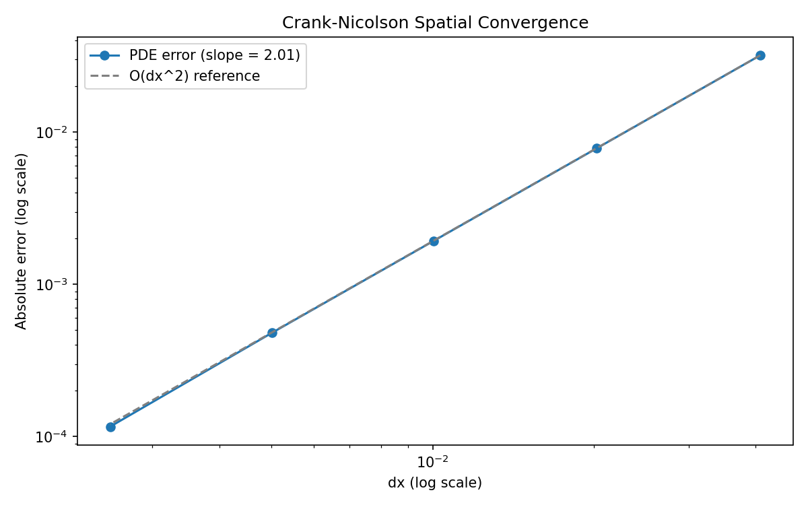
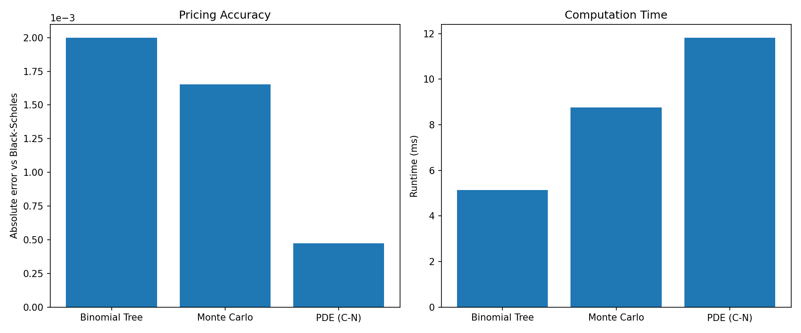
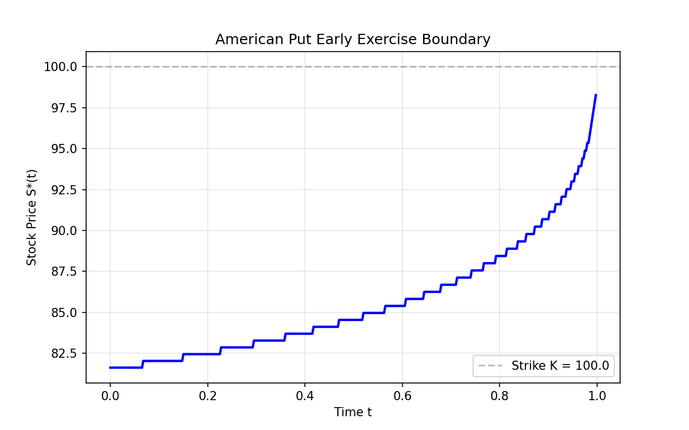
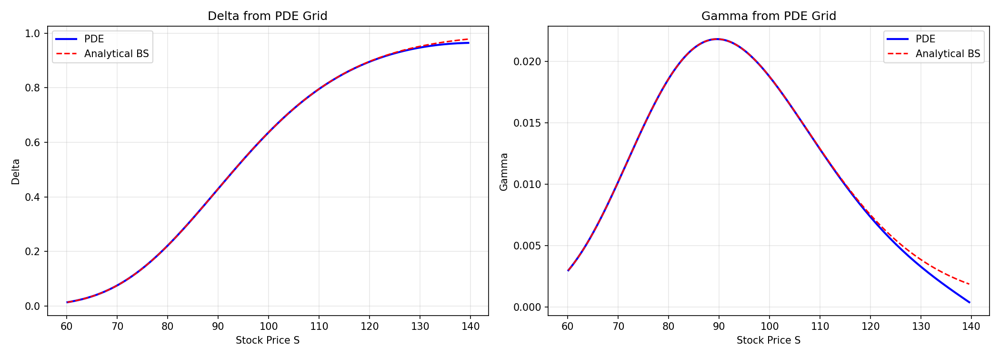

# Options Pricing Engine

A multi-model derivatives pricing library implementing Black-Scholes, binomial trees, finite-difference PDE solvers, and Monte Carlo methods — with extensions to stochastic volatility (Heston) and rough volatility (rough Bergomi). Built to compare analytical, numerical, and simulation-based approaches on equal footing.

## Key Results

### Engine Comparison (European Put, S₀=100, K=100, T=1, r=5%, σ=20%)

| Method | Price | Error vs. Analytical | Runtime (ms) |
|--------|-------|---------------------|-------------|
| Black-Scholes (analytical) | 5.5735 | — | <1 |
| Binomial Tree (N=1000) | 5.5715 | 2.0e-3 | ~5 |
| Monte Carlo (100k paths) | 5.5752 | 1.7e-3 | ~10 |
| Crank-Nicolson PDE (400×400) | 5.5740 | 4.8e-4 | ~13 |

### Convergence & Visualization


*Measured O(Δx²) convergence rate (slope = 2.01), confirming second-order spatial accuracy.*




*Early exercise boundary S*(t) extracted from the PDE solver. Below this curve, immediate exercise dominates continuation value.*


*Delta and gamma computed from the PDE solution grid via finite differences in log-price, converted using the chain rule. Overlaid with analytical Black-Scholes values.*

## Mathematical Background

### Risk-Neutral Valuation
The price of a European contingent claim with payoff $h(S_T)$ is the discounted expectation under the risk-neutral measure $\mathbb{Q}$:

$$V_0 = e^{-rT}\,\mathbb{E}^{\mathbb{Q}}[h(S_T)]$$

where $\mathbb{Q}$ is the unique equivalent martingale measure under which discounted asset prices are martingales. The existence of $\mathbb{Q}$ is equivalent to no-arbitrage (First Fundamental Theorem); its uniqueness corresponds to market completeness (Second Fundamental Theorem).

### Models Implemented
- **Black-Scholes**: Constant volatility; analytical solution via the heat equation.
- **Binomial trees (CRR)**: Discrete-time approximation converging to Black-Scholes 
- **Finite differences (Crank-Nicolson)**: Direct numerical solution of the Black-Scholes PDE; handles American exercise via penalty method.
- **Monte Carlo**: Simulation of the risk-neutral SDE with variance reduction (antithetic variates, control variates).
- **Heston**: Stochastic volatility with a mean-reverting CIR variance process correlated to the price. Priced by Gil–Pelaez inversion of the characteristic function in the stable \varphi_2​ form of Albrecher et al. (2007), which avoids the branch discontinuities that make the original Heston (1993) formulation numerically fragile at long maturities.
- **Rough Bergomi**: Fractional volatility driven by fractional Brownian motion with $H < \tfrac{1}{2}$; priced via Monte Carlo.

## Validation
 
The Heston implementation is validated by a 53-test suite in `tests/test_heston.py`, organized so that each group isolates a distinct failure mode:
 
1. **Construction (9 tests).** Parameter constraints enforced at `__post_init__`; the Feller condition $2\kappa\theta < \sigma_v^2$ is checked and warned on, not enforced, since violating it is a legitimate modelling choice.
2. **Characteristic function identities (16 tests).** The two identities $\varphi(0, T) = 1$ and $\varphi(-i, T) = S_0 e^{rT}$ hold by definition — the first because probability measures integrate to one, the second because $S_t e^{-rt}$ is a $\mathbb{Q}$-martingale. Tested both at the special points (short-circuit branches) and via the general Gatheral (2006, Eq. 2.12) formula.
3. **Benchmark prices (4 tests).** ATM call prices at $K = 100$, $T \in \{1, 2, 5, 10\}$ match Albrecher et al. (2007), Table 2, to within one cent, on the DAX-calibrated parameter set $(v_0, \kappa, \theta, \sigma_v, \rho) = (0.0175, 1.5768, 0.0398, 0.5751, -0.5711)$.
4. **Put–call parity (12 tests).** $C - P = S_0 - Ke^{-rT}$ tested across three moneynesses and four maturities. The put is priced independently by Gil–Pelaez rather than by rearranging parity, so this is a genuine cross-check.
5. **Black–Scholes limit (12 tests).** Setting $\sigma_v \to 0$, $\theta = v_0$, $\rho = 0$ reduces Heston to Black–Scholes with constant volatility $\sqrt{v_0}$; the two pricers agree to `abs=1e-3` across the surface.

## Quickstart

```bash
git clone https://github.com/lgomez010/options-pricing-engine.git
cd options-pricing-engine
pip install numpy scipy matplotlib pytest
pytest                                    
python notebooks/pde_visualizations.py    # generate all plots
```

## Project Structure

```
options-pricing-engine/
├── src/
│   ├── models/
│   │   ├── black_scholes.py    # Closed-form BS pricing and Greeks
│   │   └── gbm.py              # GBM model (PDE coefficients, MC simulation)
│   ├── payoffs/
│   │   └── european.py          # Call/Put payoff and boundary conditions
│   ├── engines/
│   │   ├── binomial_tree.py     # CRR binomial tree (European & American)
│   │   ├── monte_carlo.py       # MC with antithetic/control variates, pathwise Greeks
│   │   └── pde_solver.py        # Crank-Nicolson FD solver with American exercise
├── tests/
│   ├── test_black_scholes.py    # Put-call parity, delta, gamma-vega, FD gamma
│   ├── test_binomial_tree.py    # BS convergence, American ≥ European
│   ├── test_monte_carlo.py      # Convergence, variance reduction, pathwise Greeks
│   └── test_pde_solver.py       # European/American pricing, spatial convergence O(Δx²)
├── notebooks/
│   └── pde_visualizations.py    # Convergence, comparison, boundary, Greeks plots
├── pyproject.toml
└── README.md
```

## Extensions & Limitations

### What this project demonstrates
- Rigorous comparison of analytical, numerical, and simulation approaches on identical test cases.
- Greeks computed via three methods: analytical (BS), finite-difference, and pathwise Monte Carlo.
- Convergence analysis showing each method's error-vs-compute tradeoff.

### Known limitations
- Rough Bergomi implementation uses naive Cholesky simulation of fBm, which is $O(N^3)$; hybrid schemes (e.g., Bayer-Friz-Gatheral) would improve scaling.
- No jump-diffusion models (Merton, Kou) — a natural next step.
- American option pricing via PDE only; least-squares Monte Carlo (Longstaff-Schwartz) would extend the MC engine.

### Connection to broader portfolio
This engine provides the pricing foundation for the [`volatility-surface-lab`](https://github.com/lgomez010/volatility-surface-lab) project, where these models are calibrated to market-observed implied volatility surfaces.

## References
 
- Gatheral, J. (2006). *The Volatility Surface: A Practitioner's Guide*. Wiley. Ch. 2.
- Albrecher, H., Mayer, P., Schoutens, W., & Tistaert, J. (2007). "The Little Heston Trap." *Wilmott Magazine*, 83–92.
- Heston, S. L. (1993). "A closed-form solution for options with stochastic volatility with applications to bond and currency options." *Review of Financial Studies*, 6(2), 327–343.


## License

MIT
